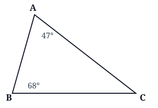
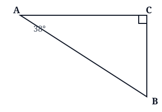
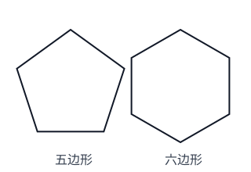
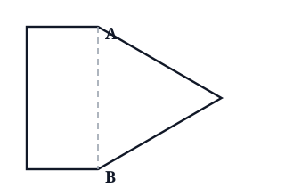
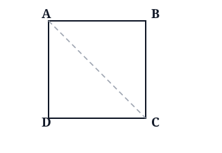
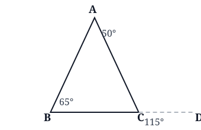
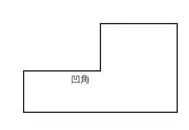
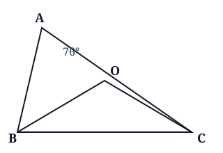
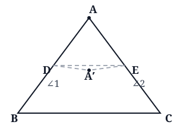

## 一、内角和与角度计算

**核心思想**：三角形内角和 = 180°；直角三角形两个锐角互余；角平分线把角分成相等的两半。求角时常用"整体与部分"：先算能算出的角，再倒推出要求的角。题目里没说某个角是"顶角"还是"底角"时，要分类讨论。

::: {.problem-card}
**例 1**：一个三角形的两个角分别是 47° 和 68°，第三个角是多少度？

{width=7cm}

:::

::: {.problem-card}
**例 2**：直角三角形中，一个锐角是 38°，另一个锐角是多少度？如果两个锐角的差是 22°，它们各是多少度？

{width=7cm}

:::

::: {.problem-card}
**例 3**（提高）：三角形 ABC 中，∠A = 70°。E 是三角形内一点，BE、CE 分别是 ∠B、∠C 的角平分线。求 ∠BEC 的度数。

{width=7cm}

:::

::: {.problem-card}
**例 4**（提高）：三角形中，∠B 比 ∠A 大 20°，∠C 又比 ∠B 大 20°。三个角各是多少度？

:::

::: {.problem-card}
**练 1**：一个三角形的两个角分别是 25° 和 75°，第三个角是多少度？

:::

::: {.problem-card}
**练 2**：直角三角形中，两个锐角的差是 18°，它们各是多少度？

:::

::: {.problem-card}
**练 3**（提高）：一个等腰三角形中有一个角是 40°，另外两个角分别是多少度？

:::

---

## 二、多边形内角和与外角和

**核心思想**：n 边形内角和 = (n − 2) × 180°；任意多边形外角和 = 360°；正多边形每个内角 = 内角和 ÷ 边数，每个外角 = 360° ÷ 边数。给"内角和"求边数，就把它除以 180° 再加 2。

::: {.problem-card}
**例 1**：求五边形、六边形的内角和。

{width=7cm}

:::

::: {.problem-card}
**例 2**：一个多边形的内角和是 1080°，它是几边形？如果它是正多边形，一个内角是多少度？

{width=7cm}

:::

::: {.problem-card}
**例 3**（提高）：五角星有 5 个相等的尖角，这 5 个尖角的度数和是多少？

{width=7cm}

:::

::: {.problem-card}
**例 4**（提高）：一个多边形的外角和是它的内角和的一半，这个多边形是几边形？

:::

::: {.problem-card}
**练 1**：求正九边形一个内角的度数。

:::

::: {.problem-card}
**练 2**：一个多边形的内角和是 1260°，它是几边形？

:::

::: {.problem-card}
**练 3**（提高）：一个正多边形每个外角都是 60°，它是几边形？

:::

---

## 三、综合挑战

**核心思想**：把复杂图形拆成一个个三角形，综合运用内角和、三边关系、等腰等边性质。图形拼接时，"外轮廓的边数 = 各部分边数之和 − 2 × 共用边数"；求"最长/最短""最大/最小"时要先定出取值范围，再找极端。

::: {.problem-card}
**例 1**（提高）：把一个正方形和一个等边三角形拼在一起，它们共用一条边，且分居这条边的两侧。拼成的图形的外轮廓是几边形？它的内角和是多少度？

{width=7cm}

:::

::: {.problem-card}
**例 2**（进阶）：一个三角形的三条边都是整厘米数，其中两条边分别是 6cm 和 8cm。第三条边最长与最短相差多少厘米？

:::

::: {.problem-card}
**例 3**（挑战）：一个三角形的最大角是最小角的 3 倍，另一个角是最小角的 2 倍。三个角各是多少度？按角分是什么三角形？

:::

::: {.problem-card}
**例 4**（挑战）：三角形三个内角的度数都是整数，最大角是最小角的 3 倍。最小角最大可能是多少度？此时按角分是什么三角形？

:::

::: {.problem-card}
**练 1**（提高）：一个五边形剪去一个三角形后，剩下的图形最多是几边形？它的内角和是多少度？

:::

::: {.problem-card}
**练 2**（进阶）：一个等腰三角形的周长是 28cm，底边比一条腰长 4cm。三条边各是多少厘米？

:::

::: {.problem-card}
**练 3**（提高）：把一个正方形沿一条对角线剪开，得到两个三角形。每个三角形的三个角分别是多少度？

{width=7cm}

:::

---

## 四、高难挑战

**核心思想**：这一部分要用到三个"秘密武器"——① 三角形外角定理：外角 = 与它不相邻的两个内角之和；② n 角星尖角和 = 180° × (n − 4)；③ 不管凹还是凸，n 边形内角和永远是 (n − 2) × 180°。遇到极值问题，先用"内角和 180°"把三个角用一个未知数表示，再列出大小关系求范围。

::: {.problem-card}
**例 1**（外角定理）：把三角形 ABC 的边 BC 延长到 D，∠ACD 是三角形的一个外角。已知 ∠A = 50°，∠B = 65°。（1）∠ACD 是多少度？（2）观察一下，外角 ∠ACD 和 ∠A、∠B 有什么关系？

{width=7cm}

:::

::: {.problem-card}
**例 2**（n 角星）：五角星的 5 个尖角的和是 180°。照这样的规律，六角星的 6 个尖角和是多少？七角星的 7 个尖角和呢？

:::

::: {.problem-card}
**例 3**（凹多边形）：有一个图形，它有 6 条边，但其中有一个角是"凹"进去的（像一个弯折的箭头）。它的内角和是多少？

{width=7cm}

:::

::: {.problem-card}
**例 4**（极值推理）：三角形三个内角的度数都是整数，最大角与最小角相差 45°。最大角最小可能是多少度？

:::

::: {.problem-card}
**练 1**（等差角）：一个三角形的三个内角成等差数列（即相邻两角的差相等），最小的角是 40°。最大的角是多少度？

:::

::: {.problem-card}
**练 2**（对角线分割）：一个八边形，从一个顶点出发最多能引几条对角线？这些对角线能把八边形分成几个三角形？

:::

::: {.problem-card}
**练 3**（内外角关系）：一个正多边形的每个外角恰好是相邻内角的一半。这个正多边形是几边形？

:::

::: {.problem-card}
**练 4**（极值推理）：三角形三个内角都是整数，最大角是最小角的 4 倍。最大角最大可能是多少度？

:::

---

## 五、竞赛挑战

**核心思想**：竞赛题的突破口，是"先找一个立刻能算出来的角当跳板"。三大跳板：三角形内角和 180°、平角 180°、三角形外角定理（外角 = 不相邻两内角之和）。记牢两条常用规律：① 两角平分线的交角 = 90° + 顶角的一半；② 折纸折叠的本质是轴对称——对应边相等、对应角相等，折叠后顶点落到内部时，两个折角之和 = 2 × 原顶角。

::: {.problem-card}
**例 1**（角平分线交角）：三角形 ABC 中，∠A = 76°，∠B、∠C 的角平分线交于点 O。求 ∠BOC 的度数。

{width=7cm}

:::

::: {.problem-card}
**例 2**（折叠规律）：把三角形纸片 ABC 沿折痕 DE 折叠（D 在边 AB 上、E 在边 AC 上），使顶点 A 落到三角形内部的点 A′。折叠后，折痕与边 AB 相交的 D 点处出现折角 ∠A′DB，记作 ∠1；折痕与边 AC 相交的 E 点处出现折角 ∠A′EC，记作 ∠2。已知 ∠A = 65°，求 ∠1 + ∠2 的度数。

{width=7cm}

:::

::: {.problem-card}
**例 3**（比例极值）：三角形三个内角都是整数度，最小角与最大角的比是 1:5。最大角最大可能是多少度？

:::

::: {.problem-card}
**例 4**（内外角倍比）：一个正多边形，每个内角恰好是一个外角的 4 倍，它是几边形？

:::

::: {.problem-card}
**练 1**（角平分线逆向）：三角形 ABC 中，∠B、∠C 的角平分线交于点 O，∠BOC = 110°。求 ∠A。

:::

::: {.problem-card}
**练 2**（折叠应用）：把三角形纸片沿折痕折叠，使顶点 A 落到内部，测得两个折角 ∠1 = 60°、∠2 = 80°。原来的顶角 ∠A 是多少度？

:::

::: {.problem-card}
**练 3**（互异极值）：三角形三个内角都是整数且互不相等，最大角最小可能是多少度？

:::

::: {.problem-card}
**练 4**（枚举计数）：三角形三个内角都是整数度，最大的角比最小的角大 50°。这样的三角形有多少个？

:::

## 答案 · 一、内角和与角度计算

::: {.answer-card}
**例 1**：第三角 = 180° − 47° − 68° = **65°**。

:::

::: {.answer-card}
**例 2**：另一个锐角 = 90° − 38° = **56°**。设较小锐角为 x°，则 x + (x + 22) = 90，解得 x = 34，两个锐角分别是 **34°、56°**。

:::

::: {.answer-card}
**例 3**：∠B + ∠C = 180° − 70° = 110°。BE、CE 平分后，两个半角之和 = 110° ÷ 2 = 55°。在三角形 BEC 中，∠BEC = 180° − 55° = **125°**。

:::

::: {.answer-card}
**例 4**：设 ∠A = x°，则 ∠B = x + 20，∠C = x + 40。x + (x + 20) + (x + 40) = 180，3x + 60 = 180，x = 40。三个角分别是 **40°、60°、80°**。

:::

::: {.answer-card}
**练 1**：第三角 = 180° − 25° − 75° = **80°**。

:::

::: {.answer-card}
**练 2**：设较小锐角为 x°，则 x + (x + 18) = 90，解得 x = 36。两个锐角分别是 **36°、54°**。

:::

::: {.answer-card}
**练 3**：分两类。（1）40° 是顶角：底角 = (180° − 40°) ÷ 2 = 70°，另两角都是 **70°**。（2）40° 是底角：另一底角也是 40°，顶角 = 180° − 40° × 2 = **100°**。所以可能是 70°、70°，或 40°、100°。

:::

---

## 答案 · 二、多边形内角和与外角和

::: {.answer-card}
**例 1**：五边形：(5 − 2) × 180° = **540°**；六边形：(6 − 2) × 180° = **720°**。

:::

::: {.answer-card}
**例 2**：(n − 2) × 180° = 1080°，n − 2 = 6，n = 8，是**八边形**。正八边形一个内角 = 1080° ÷ 8 = **135°**。

:::

::: {.answer-card}
**例 3**：每个尖角 **36°**，5 个尖角共 **180°**。理由：五角星中间的凹多边形是正五边形，每个内角 108°，它的外角 = 180° − 108° = 72°；每个尖角所在的等腰三角形两个底角各 72°，顶角 = 180° − 72° × 2 = 36°。

:::

::: {.answer-card}
**例 4**：外角和恒为 360°，是内角和的一半 → 内角和 = 720°。(n − 2) × 180° = 720°，n − 2 = 4，n = 6，是**六边形**。

:::

::: {.answer-card}
**练 1**：(9 − 2) × 180° = 1260°，1260° ÷ 9 = **140°**。

:::

::: {.answer-card}
**练 2**：(n − 2) × 180° = 1260°，n − 2 = 7，n = 9，是**九边形**。

:::

::: {.answer-card}
**练 3**：外角和恒为 360°，360° ÷ 60° = 6，是**正六边形**。

:::

---

## 答案 · 三、综合挑战

::: {.answer-card}
**例 1**：外轮廓边数 = 正方形 4 边 + 三角形 2 边 − 共用 1 边（算了 2 次）= 5 边，是**五边形**。内角和 = (5 − 2) × 180° = **540°**。

:::

::: {.answer-card}
**例 2**：第三边范围：8 − 6 < 第三边 < 8 + 6，即 3 ~ 13 厘米的整数。最长 13cm、最短 3cm，相差 13 − 3 = **10cm**。

:::

::: {.answer-card}
**例 3**：设最小角为 x°，则三内角为 x、2x、3x。x + 2x + 3x = 180°，6x = 180°，x = 30°。三个角分别是 **30°、60°、90°**，是**直角三角形**。

:::

::: {.answer-card}
**例 4**：设最小角为 x°，最大角为 3x°，另一个角为 180° − 4x°。它必须不小于最小角、不大于最大角：由 x ≤ 180° − 4x 得 x ≤ 36°；由 180° − 4x ≤ 3x 得 x ≥ 25.7…，x 取整数所以 x ≥ 26。x 最大取 **36°**，此时三个角 36°、36°、108°，是**等腰钝角三角形**。

:::

::: {.answer-card}
**练 1**：剪去一个跨过两条边的角，剩下的图形最多是**六边形**。内角和 = (6 − 2) × 180° = **720°**。

:::

::: {.answer-card}
**练 2**：设一条腰为 x cm，则底边为 (x + 4) cm。2x + (x + 4) = 28，3x = 24，x = 8。腰 **8cm**、底边 **12cm**。验证：8 + 8 = 16 > 12，能围成。

:::

::: {.answer-card}
**练 3**：正方形沿对角线剪开，得到两个全等的等腰直角三角形，每个三角形的三个角分别是 **45°、45°、90°**。

:::

---

## 答案 · 四、高难挑战

::: {.answer-card}
**例 1**：（1）先算 ∠C = 180° − 50° − 65° = 65°，外角 ∠ACD = 180° − 65° = **115°**。（2）发现 ∠ACD = ∠A + ∠B = 50° + 65° = **115°**。结论：三角形的一个外角等于与它不相邻的两个内角之和。

:::

::: {.answer-card}
**例 2**：规律：n 角星尖角和 = 180° × (n − 4)。六角星 = 180° × 2 = **360°**；七角星 = 180° × 3 = **540°**。验证：五角星 n = 5，180° × 1 = 180° ✓。

:::

::: {.answer-card}
**例 3**：凹进去的多边形一样用公式：(6 − 2) × 180° = **720°**。不管图形往里凹还是往外凸，只要边数一样，内角和就一样。

:::

::: {.answer-card}
**例 4**：设最小角为 x°，则最大角为 (x + 45)°，另一个角 = 180° − x − (x + 45) = (135 − 2x)°。它必须夹在中间：x ≤ 135 − 2x ≤ x + 45。由 x ≤ 135 − 2x 得 x ≤ 45；由 135 − 2x ≤ x + 45 得 x ≥ 30。最小角最小取 **30°**，此时最大角 = 30 + 45 = **75°**。验证三个角 30°、45°、75°，和为 180°。

:::

::: {.answer-card}
**练 1**：设三个角为 40°、40° + d、40° + 2d，和 = 120° + 3d = 180°，d = 20°。最大角 = 40° + 2 × 20° = **80°**。

:::

::: {.answer-card}
**练 2**：从一个顶点出发，与它本身和相邻的两个顶点都不能连对角线，能引 8 − 3 = **5 条**对角线。每引一条对角线就多一个三角形，能分成 8 − 2 = **6 个**三角形。

:::

::: {.answer-card}
**练 3**：设每个外角为 x°，则相邻内角为 2x°。x + 2x = 180°，x = 60°。外角和 360°，360° ÷ 60° = **6**，是**正六边形**。

:::

::: {.answer-card}
**练 4**：设最小角为 x°，则最大角为 4x°，另一个角 = 180° − 5x°。它必须夹在中间：x ≤ 180 − 5x ≤ 4x。由 x ≤ 180 − 5x 得 x ≤ 30；由 180 − 5x ≤ 4x 得 x ≥ 20。最大角 = 4x，要最大，x 取最大 **30°**，最大角 = 4 × 30 = **120°**。验证三个角 30°、30°、120°，是等腰钝角三角形。

:::

---

## 答案 · 五、竞赛挑战

::: {.answer-card}
**例 1**：∠BOC = 90° + ∠A ÷ 2 = 90° + 38° = **128°**。规律：三角形两内角平分线的交角 = 90° + 第三个角的一半。

:::

::: {.answer-card}
**例 2**：∠1 + ∠2 = **130°**。推导：连接 AA′，折叠得 DA = DA′、EA = EA′（对应边相等），所以 △DAA′、△EAA′ 都是等腰三角形，∠DAA′ = ∠DA′A = x、∠EAA′ = ∠EA′A = y，且 x + y = ∠A = 65°。由外角定理，∠1 = ∠BDA′ = 2x、∠2 = ∠A′EC = 2y。∠1 + ∠2 = 2(x + y) = 2 × 65° = **130°**。规律：折叠后顶点落到内部时，折角之和 = 2 × 顶角。

:::

::: {.answer-card}
**例 3**：设最小角 x°，最大角 5x°，另一角 = 180° − 6x°。它必须夹在中间：x ≤ 180 − 6x ≤ 5x。由 x ≤ 180 − 6x 得 x ≤ 25（180 ÷ 7 ≈ 25.7，取整 25）；由 180 − 6x ≤ 5x 得 x ≥ 17（180 ÷ 11 ≈ 16.36，取整 17）。x 最大取 **25°**，最大角 = 5 × 25 = **125°**。验算三个角 25°、30°、125°，和 180° ✓。

:::

::: {.answer-card}
**例 4**：设每个外角 x°，则相邻内角 4x°。外角 + 内角 = 180°，5x = 180，x = 36°。外角和恒为 360°，360° ÷ 36° = **10**，是**正十边形**。

:::

::: {.answer-card}
**练 1**：∠BOC = 90° + ∠A ÷ 2 = 110°，所以 ∠A ÷ 2 = 20°，**∠A = 40°**。

:::

::: {.answer-card}
**练 2**：折角之和 = 2 × 顶角：∠1 + ∠2 = 60° + 80° = 140° = 2∠A，**∠A = 70°**。

:::

::: {.answer-card}
**练 3**：三个数要尽量都接近平均数 180 ÷ 3 = 60°，且互不相等，取 **59°、60°、61°**，最大角最小 = **61°**。

:::

::: {.answer-card}
**练 4**：设最小角 x°，最大角 (x + 50)°，另一角 = 180° − x − (x + 50) = (130 − 2x)°。它必须夹在中间：x ≤ 130 − 2x ≤ x + 50。由 x ≤ 130 − 2x 得 x ≤ 43；由 130 − 2x ≤ x + 50 得 x ≥ 27。x = 27、28、…、43，共 43 − 27 + 1 = **17 个**。

:::
