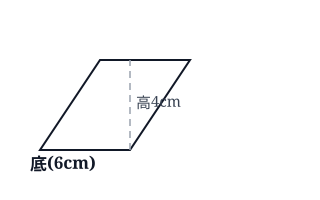
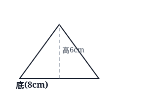
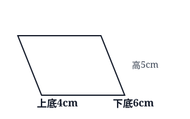
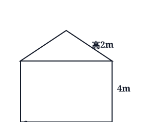
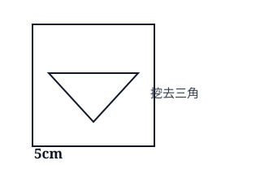

## 一、平行四边形面积

**核心思想**：把平行四边形沿高剪开，拼成长方形，面积不变。**平行四边形面积 = 底 × 高**，用字母表示 S = ah。注意：高必须和底垂直，计算时底和高要对应。

::: {.problem-card}
**例 1**：一个平行四边形，底是 6 厘米，高是 4 厘米，面积是多少？

{width=7cm}

:::

::: {.problem-card}
**例 2**：一个平行四边形的面积是 36 平方分米，底是 9 分米，高是多少？

:::

::: {.problem-card}
**例 3**：一个平行四边形的底是 2.5 米，高是 1.2 米，面积是多少平方米？

:::

::: {.problem-card}
**练 1**：平行四边形底 8 厘米、高 5 厘米，面积是多少？

:::

::: {.problem-card}
**练 2**：面积是 48 平方厘米，高是 6 厘米，底是多少？

:::

::: {.problem-card}
**练 3**：平行四边形底 3.6 米、高 2 米，面积是多少平方米？

:::

---

## 二、三角形面积

**核心思想**：两个完全一样的三角形可以拼成一个平行四边形，所以**三角形面积 = 底 × 高 ÷ 2**，字母表示 S = ah ÷ 2。**别忘了除以 2**——这是最常错的地方。求底或高时，先乘 2 再除以已知的那个量。

::: {.problem-card}
**例 1**：一个三角形，底是 8 厘米，高是 6 厘米，面积是多少？

{width=7cm}

:::

::: {.problem-card}
**例 2**：三角形面积是 24 平方厘米，底是 8 厘米，高是多少？

:::

::: {.problem-card}
**例 3**：一个直角三角形的两条直角边分别是 3 厘米和 4 厘米，面积是多少？

:::

::: {.problem-card}
**练 1**：三角形底 10 厘米、高 4 厘米，面积是多少？

:::

::: {.problem-card}
**练 2**：三角形面积是 30 平方厘米，高是 6 厘米，底是多少？

:::

::: {.problem-card}
**练 3**：一个三角形底是 5.6 分米、高是 2.5 分米，面积是多少平方分米？

:::

---

## 三、梯形面积

**核心思想**：两个完全一样的梯形可以拼成一个平行四边形，所以**梯形面积 = (上底 + 下底) × 高 ÷ 2**，字母 S = (a + b)h ÷ 2。关键是"上底加下底"，别忘记括号里的加法先算。

::: {.problem-card}
**例 1**：一个梯形，上底 4 厘米、下底 6 厘米、高 5 厘米，面积是多少？

{width=7cm}

:::

::: {.problem-card}
**例 2**：梯形的上底 3.2 米、下底 4.8 米、高 2.5 米，面积是多少平方米？

:::

::: {.problem-card}
**例 3**：梯形的面积是 36 平方厘米，上底 4 厘米、下底 8 厘米，高是多少？

:::

::: {.problem-card}
**练 1**：梯形上底 5 厘米、下底 7 厘米、高 4 厘米，面积是多少？

:::

::: {.problem-card}
**练 2**：梯形的上底 2.4 分米、下底 3.6 分米、高 3 分米，面积是多少？

:::

::: {.problem-card}
**练 3**：梯形面积是 24 平方厘米，上底 3 厘米、高 6 厘米，下底是多少？

:::

---

## 四、组合图形面积

**核心思想**：组合图形用**割补法**——把它分成几个基本图形（长方形、三角形、梯形），分别算出面积再加起来；或者先补成一个完整图形，再减去补上的部分。**割**就是把不规则的拆成规则的。

::: {.problem-card}
**例 1**：一个图形由长方形（长 6 米、宽 4 米）和一个三角形（底 6 米、高 2 米）拼成，面积是多少？

{width=7cm}

:::

::: {.problem-card}
**例 2**：一个正方形边长为 5 厘米，中间挖去一个三角形（底 4 厘米、高 2 厘米），剩下的面积是多少？

{width=7cm}

:::

::: {.problem-card}
**例 3**：求下面图形的面积：一个梯形（上底 3 厘米、下底 5 厘米、高 4 厘米）上面叠着一个同样高的长方形（宽 3 厘米、高 4 厘米）。

:::

::: {.problem-card}
**练 1**：长方形长 8 厘米、宽 5 厘米，上面加一个三角形（底 8 厘米、高 3 厘米），总面积是多少？

:::

::: {.problem-card}
**练 2**：一个边长 4 米的正方形，去掉一个梯形（上底 1 米、下底 2 米、高 4 米），剩下面积是多少？

:::

::: {.problem-card}
**练 3**：两个完全一样的长方形（长 6 厘米、宽 3 厘米）拼成一个大长方形，大长方形的面积是多少？

:::

## 答案 · 一、平行四边形面积

::: {.answer-card}
**例 1**：6 × 4 = **24 平方厘米**。

:::

::: {.answer-card}
**例 2**：高 = 面积 ÷ 底 = 36 ÷ 9 = **4 分米**。

:::

::: {.answer-card}
**例 3**：2.5 × 1.2 = **3 平方米**。

:::

::: {.answer-card}
**练 1**：8 × 5 = **40 平方厘米**。

:::

::: {.answer-card}
**练 2**：底 = 48 ÷ 6 = **8 厘米**。

:::

::: {.answer-card}
**练 3**：3.6 × 2 = **7.2 平方米**。

:::

---

## 答案 · 二、三角形面积

::: {.answer-card}
**例 1**：8 × 6 ÷ 2 = **24 平方厘米**。

:::

::: {.answer-card}
**例 2**：高 = 面积 × 2 ÷ 底 = 24 × 2 ÷ 8 = **6 厘米**。

:::

::: {.answer-card}
**例 3**：3 × 4 ÷ 2 = **6 平方厘米**。（直角边互为底和高）

:::

::: {.answer-card}
**练 1**：10 × 4 ÷ 2 = **20 平方厘米**。

:::

::: {.answer-card}
**练 2**：底 = 30 × 2 ÷ 6 = **10 厘米**。

:::

::: {.answer-card}
**练 3**：5.6 × 2.5 ÷ 2 = **7 平方分米**。

:::

---

## 答案 · 三、梯形面积

::: {.answer-card}
**例 1**：(4 + 6) × 5 ÷ 2 = 10 × 5 ÷ 2 = **25 平方厘米**。

:::

::: {.answer-card}
**例 2**：(3.2 + 4.8) × 2.5 ÷ 2 = 8 × 2.5 ÷ 2 = **10 平方米**。

:::

::: {.answer-card}
**例 3**：高 = 面积 × 2 ÷ (上底 + 下底) = 36 × 2 ÷ (4 + 8) = 72 ÷ 12 = **6 厘米**。

:::

::: {.answer-card}
**练 1**：(5 + 7) × 4 ÷ 2 = **24 平方厘米**。

:::

::: {.answer-card}
**练 2**：(2.4 + 3.6) × 3 ÷ 2 = **9 平方分米**。

:::

::: {.answer-card}
**练 3**：下底 = 面积 × 2 ÷ 高 − 上底 = 24 × 2 ÷ 6 − 3 = 8 − 3 = **5 厘米**。

:::

---

## 答案 · 四、组合图形面积

::: {.answer-card}
**例 1**：长方形 6 × 4 = 24，三角形 6 × 2 ÷ 2 = 6，总面积 = 24 + 6 = **30 平方米**。

:::

::: {.answer-card}
**例 2**：正方形 5 × 5 = 25，挖去三角形 4 × 2 ÷ 2 = 4，剩下 = 25 − 4 = **21 平方厘米**。

:::

::: {.answer-card}
**例 3**：梯形 (3 + 5) × 4 ÷ 2 = 16，长方形 3 × 4 = 12，总面积 = 16 + 12 = **28 平方厘米**。

:::

::: {.answer-card}
**练 1**：长方形 8 × 5 = 40，三角形 8 × 3 ÷ 2 = 12，总面积 = **52 平方厘米**。

:::

::: {.answer-card}
**练 2**：正方形 4 × 4 = 16，去掉梯形 (1 + 2) × 4 ÷ 2 = 6，剩下 = 16 − 6 = **10 平方米**。

:::

::: {.answer-card}
**练 3**：两个长方形拼成长 12 厘米、宽 3 厘米的大长方形：12 × 3 = **36 平方厘米**。

:::
